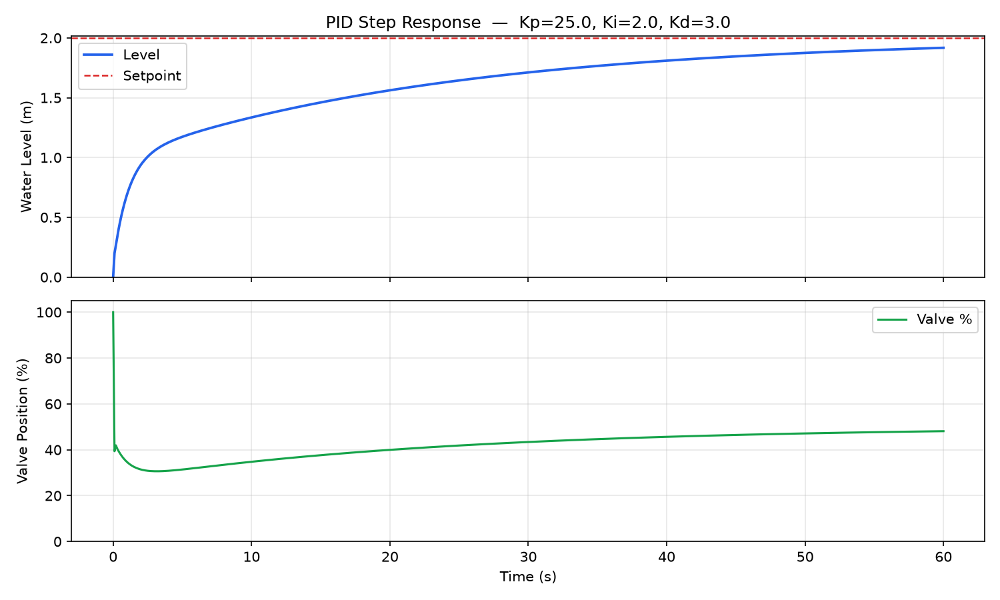
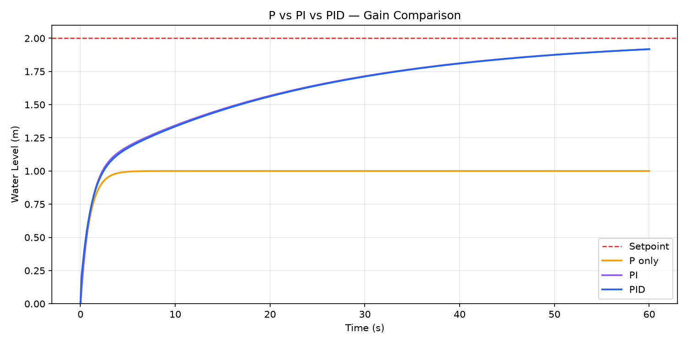

# Tank PID Controller

A very simple PID controller simulation for a water tank, implemented from scratch in Python. The controller adjusts a valve to maintain a target water level despite continuous outflow.

---

## The Problem

A tank fills via an inlet valve and drains at a rate proportional to the current water level. The goal is to reach and hold a setpoint level using only the valve as the control input.

## Physics

**Tank model:**

$$\frac{dh}{dt} = \frac{Q_{in} - Q_{out}}{A}$$

- $Q_{in} = \frac{\text{valve\%}}{100} \times Q_{max}$ — inflow scales linearly with valve position  
- $Q_{out} = k \cdot h$ — outflow is proportional to current level (gravity drain)  
- $A$ — cross-sectional area of the tank

**PID controller:**

```
error      = setpoint − measurement
P_term     = Kp × error
integral   = integral + error × dt        →  I_term = Ki × integral
derivative = (error − prev_error) / dt    →  D_term = Kd × derivative
output     = clamp(P_term + I_term + D_term, 0, 100)
prev_error = error
```

---

## Project Structure

```
tank-pid-controller/
├── pid_controller.py   # PID algorithm
├── tank_model.py       # Tank plant model
├── simulation.py       # Simulation harness and plots
├── plots/              # Saved figures from tuning 
├── requirements.txt
└── README.md
```

## Setup & Run

```bash
pip install -r requirements.txt
python simulation.py
```

---

## Tuning

**Parameters:** `A = 1.0 m²`, `Q_max = 2.0 m³/s`, `k = 0.5 /s`, `setpoint = 2.0 m`, `dt = 0.1 s`

**Gains used:** `Kp = 25`, `Ki = 2`, `Kd = 3`

### Step response



The valve opens fully at t=0 to fill as fast as possible, then pulls back sharply as the level rises. It gradually settles near 50% — which is the steady-state operating point where inflow equals outflow at the target level.

### P vs PI vs PID



- **P only** — fast initial rise but stalls permanently at 1.0 m (50% of setpoint). Proportional control alone can't eliminate steady-state error; it can only push harder when the error is large, so once the plant reaches equilibrium below the setpoint, it stops.
- **PI / PID** — the integral term keeps accumulating error and drives the level all the way to the setpoint. The derivative term has minimal visible effect on this first-order plant but would matter more with a faster, oscillation-prone system.

---

## What I Learned

- P-only control always has steady-state error on this plant — you can see exactly how much from the math: `level_ss = SP / (1 + Kp × DC_gain)`
- Adding I eliminates the error but slows things down; the tradeoff is real
- Anti-windup matters — without it, the integral accumulates during the initial saturated phase and causes overshoot
- Keeping the plant, controller, and simulation loop in separate files made it easy to swap gains and run comparisons without touching the core logic

---

> PID controller implemented from scratch — no control library used.


